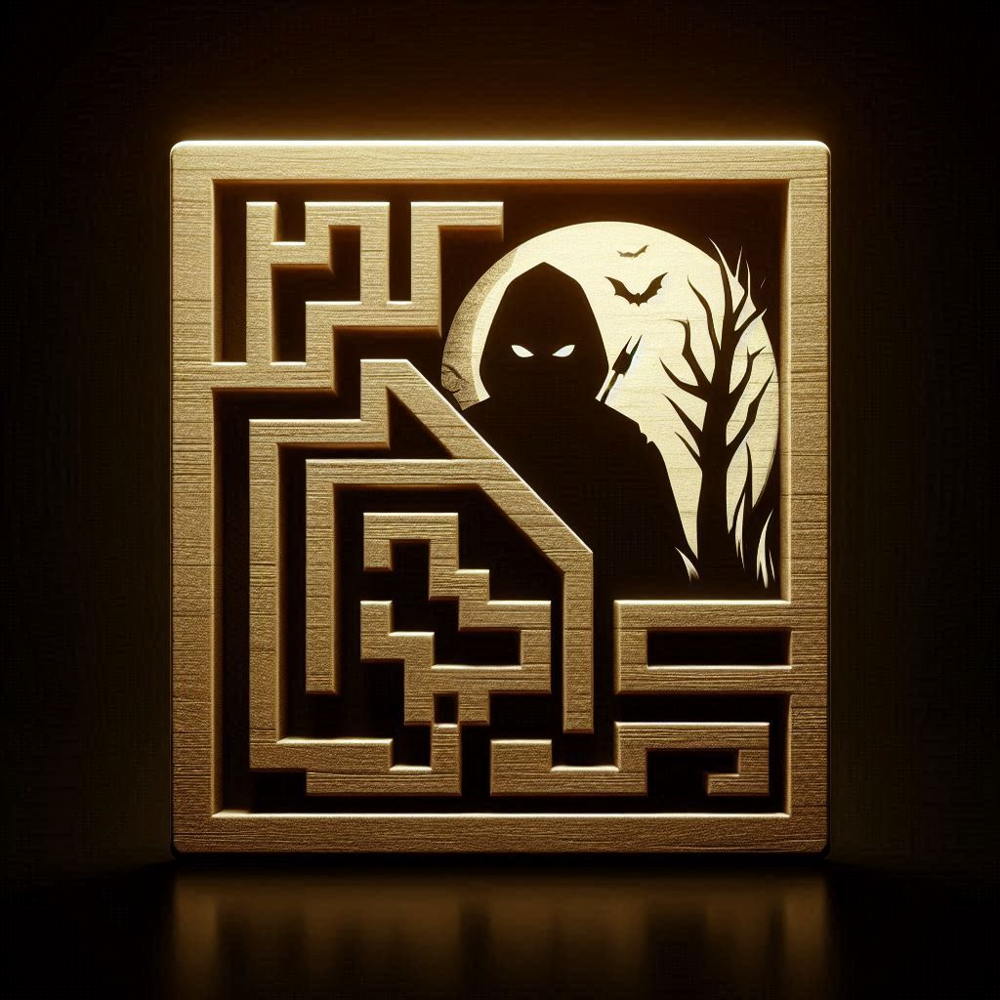
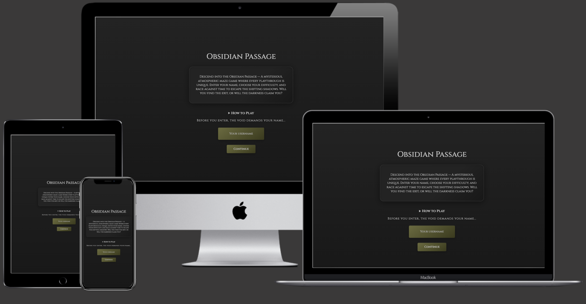
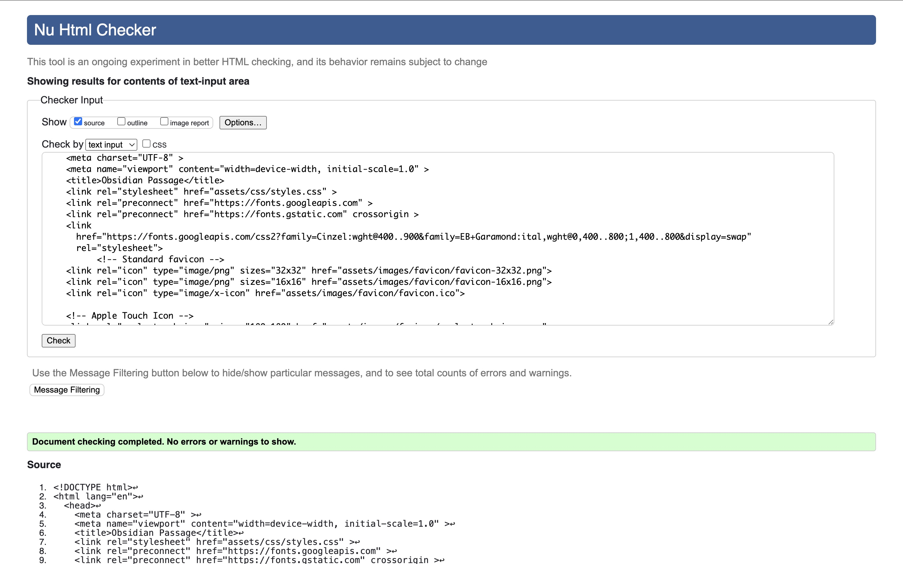
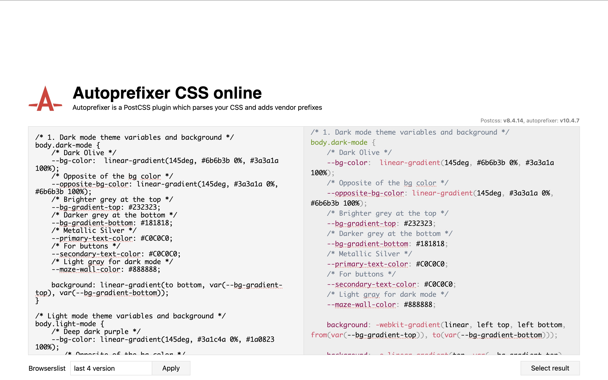
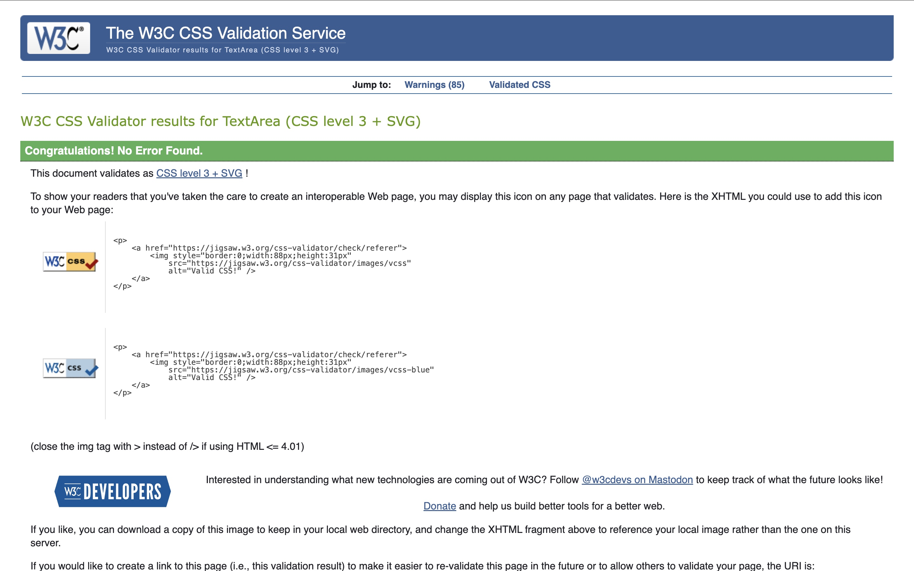
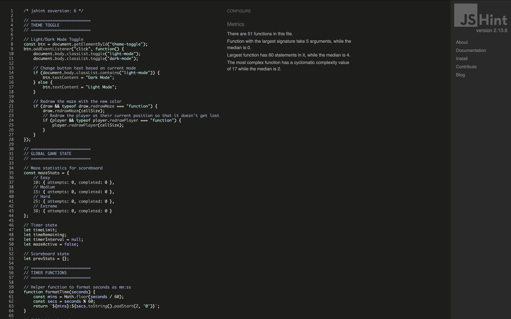
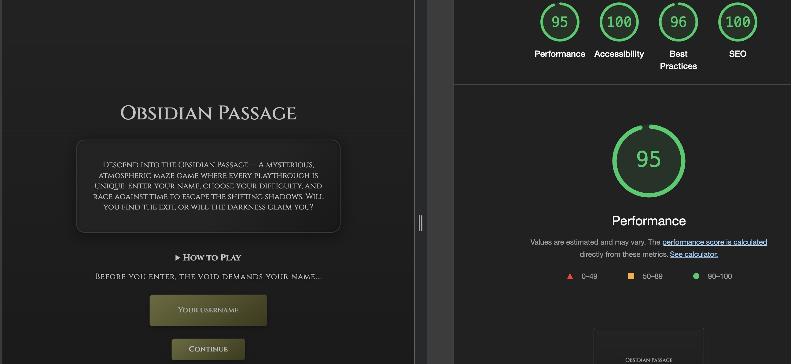

# Obsidian Passage 

A mysterious, atmospheric maze game for the web.

### **Live Website**
🔗 **Play the Game Here:** [Obsidian Passage](https://johnxt10.github.io/obsidian-passage/)  

---
## **Introduction**

Obsidian Passage is a one-page browser-based maze game with a dark, mysterious theme. Each playthrough generates a unique maze for you to solve before time runs out. Enter your name, explore the passage, and race against the clock—playable on both desktop and mobile, no installation required.

## 📖 Table of Contents

- [📌 Project Overview](#project-overview)
- [🖥️ UX/UI Design](#uxui-design)
- [🧑‍🚶‍♂️ User Stories](#️user-stories)
- [⚜️ Design choices](#design-choices)
  - [🎨 Colours](#colours)
  - [🔠 Fonts](#fonts)
  - [Structure](#structure)
- [🗺️ Wireframes](#wireframes)
- [🖼️ Imagery](#imagery)
- [✨ Features](#features)
- [🛠️ Built With](#️built-with)
- [✅ Testing](#testing)
- [🌐 Deployment](#deployment)
- [🔮 Future Features](#future-features)
- [🐛 Known Bugs](#known-bugs)
- [📚 Citation](#citation)

---

## **Project Overview**
**Key Objectives:**  

- Create an engaging, interactive maze game that runs entirely in the browser using **HTML, CSS, and JavaScript**. .
- Deliver a seamless experience across devices with a focus on accessibility and modern design.
- Maintain clean, standards-compliant code validated by industry tools such as **W3C Validator**.
- Make the game easily accessible online through version control and web hosting - deployed using **Github pages**.

---

## **UX/UI Design**

- Dark, atmospheric interface inspired by mysterious passages and ancient ruins.
- Responsive layout for desktop and mobile.
- Intuitive controls and clear feedback for player actions.

---

### User Stories
**As a player, I want to...**  
- Enter my name and see it in-game.
- Navigate the maze using keyboard or touch controls.
- See a timer and my score.
- Try again after winning or losing.
- See button controls for smaller devices.
- Use on-screen buttons for movement on mobile without affecting other page elements.

---

## **Design Choices**

### Colours

A great deal of thought went into selecting each colour for Obsidian Passage. The palette was chosen to create a mysterious, immersive atmosphere while ensuring **accessibility** and **clarity**. Each colour serves a specific purpose, from guiding the player’s focus to providing clear feedback for actions and states.

| Colour Name   | Value                                 | Usage                        |
|---------------|---------------------------------------|------------------------------|
| ⚫️ **Obsidian Black**| `#1a1a1a`                             | Background, modal overlays   |
| ⚪️ **Light Grey**    | `(var--primary-text-color), var(--secondary-text-color)`                             | Text, borders, highlights    |
| 🔴 **Dark Red**      | `#dc143c`                             | Error messages, timer warning|
| 🟢 **Green**         | `#4caf50`                             | Success, completion feedback |
| **Button Gradient** | `var(--bg-color)` | Button backgrounds           |
| 🟢🟣 **Opposite BG**   | `var(--opposite-bg-color)`            | Button active/pressed state  |

*(See `assets/css/styles.css` for the full palette and implementation details.)*

---

### Fonts

This website uses **Cinzel** and EB **Garamond**. These typefaces were chosen to evoke an eerie, ancient atmosphere, enhancing the game’s mysterious and unsettling mood while maintaining readability across all devices.feeling

---

### Structure

The website will follow a **mobile-first** strategy, the main target is to create a visually appealing design for smaller screens. Also making sure that it's responsive on all devices.

---

## **Wireframes**

The wireframes are provided below:

### [Desktop Wireframe](readme/wireframes/desktop.png "Desktop wireframe")

### [Tablet Wireframe](readme/wireframes/tablet.png "Tablet wireframe")

### [Phone Wireframe](readme/wireframes/phone.png "Phone wireframe")

---

## **Imagery**

- Custom favicon and icon set located in `assets/images/favicon/` for a polished, branded experience.
- Themed backgrounds and UI elements designed to immerse players in a mysterious, ancient atmosphere.
- All imagery and visual assets are optimized for both desktop and mobile displays.
- Game sprites (player and goal) were produced using AI Copilot to match the eerie aesthetic of the passage.

---

## Features

### Core Gameplay
- Procedural maze generation for unique playthroughs every time
- Customizable difficulty levels (Easy, Medium, Hard, Extreme)
- Timer and scoreboard to track performance
- Themed victory and failure messages for immersive feedback
- Keyboard and touch controls for cross-device play

### UI & Experience
- Responsive design for seamless play on desktop and mobile
- On-screen arrow controls for mobile users
- Light/Dark mode toggle for accessibility and mood
- Enter your name for a personalized experience
- Themed backgrounds, icons, and custom sprites for atmosphere
- Animated transitions and feedback for player actions

---

## Built With
### 🖥️ **Technology & Languages**  
- HTML, CSS, JavaScript (Vanilla)
- [Google Fonts](https://fonts.google.com/)
- [favicon-converter](https://favicon.io/favicon-converter/) for icons

### Libraries & Frameworks
- Google Fonts (**Cinzel** and **EB Garamond**)

### 🛠️ **Tools Used**  
- **GitHub** – Version control & deployment  
- **VS Code** – Code editor  
- **Chrome DevTools** – Debugging & testing  

---

## Testing

- **HTML Validation** - Used **W3C Validator**.
  

- **CSS Validation** - Used **Autoprefixer** for cross-browser compatibility, then **Jigsaw Validator**.
  
  

- **JavaScript Debugging** - JSHint, console log & error fixing.
  

- ✅ **Lighthouse Performance Testing** – Checked for **performance**, **SEO**, and **accessibility**.
  

---

## Deployment
### Deployed using Github Pages

**Live Website** [Obsidian Passage](https://johnxt10.github.io/obsidian-passage/)  

---

## Future Features

- **Maze themes/skins:** Let users choose different visual themes (e.g., ancient ruins, neon, forest).
- **Leaderboard and persistent scores:** Track high scores and fastest times globally or per user.
- **Statistics dashboard:** Show detailed stats (e.g., average completion time, moves per game).
- **Hints or power-ups:** Optional features to help players (e.g., reveal part of the maze, freeze timer).
- **Save and resume:** Let players save their progress and continue later.

---

## Bugs

### Fixed Bugs

- Player and Goal image not loading before game start: Disabled the start button until both player and goal images were loaded.
- Victory message not appearing after maze completion: Fixed event handling to ensure the victory modal always displays when the player reaches the goal.

## Unfixed Bugs

- There are no unfixed bugs.

---

## Citation

The following resources were used in the development of **Obsidian Passage**:

### 🎨 Fonts
- **Cinzel** font from [Google Fonts](https://fonts.google.com/specimen/Cinzel)
- **EB Garamond** font from [Google Fonts](https://fonts.google.com/specimen/EB+Garamond)

### 🖼️ Images & Icons

- Player and goal images were produced using GitHub Copilot.
- Favicon and icon set generated with [favicon.io](https://favicon.io/).

### 🛠️ Libraries & Frameworks
- **HTML & CSS Autoprefixer/Validation Tools**: [W3C Validator](https://validator.w3.org/), [CSS Autoprefixer](https://autoprefixer.github.io/) & [Jigsaw CSS Validator](https://jigsaw.w3.org/css-validator/)
- **JavaScript Debugging**: Chrome DevTools [Documentation](https://developer.chrome.com/docs/devtools/). Also [JShint](https://jshint.com/)
- **GitHub Hosting**: Project is hosted using [GitHub Pages](https://pages.github.com/)

---

We hope you enjoyed exploring the depths of Obsidian Passage.  
If you have feedback, suggestions, or just want to share your high score, feel free to reach out!
