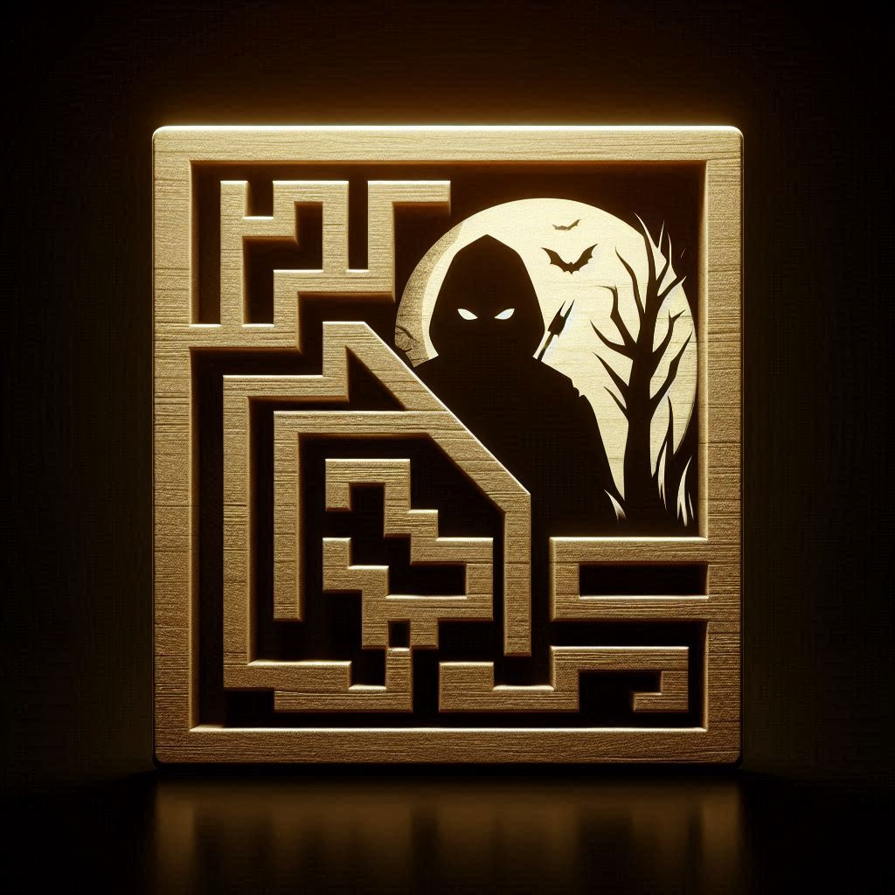
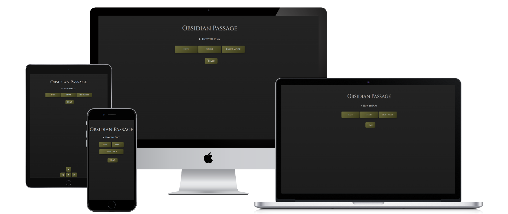

# Obsidian Passage 

A mysterious, atmospheric maze game for the web.

---
Obsidian Passage is a browser-based maze game with a dark, mysterious theme. Each playthrough generates a unique maze for you to solve before time runs out. Enter your name, explore the passage, and race against the clock—playable on both desktop and mobile, no installation required.

## 📖 Table of Contents

- [📌 Project Overview](#project-overview)
- [🖥️ UX/UI Design](#uxui-design)
- [🧑‍🚶‍♂️ User Stories](#️user-stories)
- [⚜️ Design choices](#design-choices)
  - [🎨 Colours](#colours)
  - [🔠 Fonts](#fonts)
  - [Structure](#structure)
- [🗺️ Wireframes](#wireframes)
- [🖼️ Imagery](#imagery)
- [✨ Features](#features)
- [🛠️ Built With](#️built-with)
- [✅ Testing](#testing)
- [🌐 Deployment](#deployment)
- [🔮 Future Features](#future-features)
- [🐛 Known Bugs](#known-bugs)
- [📚 Citation](#citation)

---

## Project Overview

Obsidian Passage is a browser-based maze game with an eerie, immersive theme. Players must navigate through procedurally generated mazes before time runs out.

---

## UX/UI Design

- Dark, atmospheric interface inspired by mysterious passages and ancient ruins.
- Responsive layout for desktop and mobile.
- Intuitive controls and clear feedback for player actions.

---

## User Stories

- As a player, I want to enter my name and see it in-game.
- As a player, I want to navigate the maze using keyboard or touch controls.
- As a player, I want to see a timer and my score.
- As a player, I want to try again after winning or losing.

---

## Design Choices

### Colours

- Primary: `#1a1a1a` (Obsidian Black)
- Accent: `#e0e0e0` (Light Grey)
- Error: `#8B0000` (Dark Red)
- Success: `#4caf50` (Green)
- (See `assets/css/styles.css` for full palette.)

---

### Fonts

- [Cinzel](https://fonts.google.com/specimen/Cinzel) for headings
- [EB Garamond](https://fonts.google.com/specimen/EB+Garamond) for body text

---

### Structure

---

## Wireframes

*(Add or link to your wireframes here)*

---

## Imagery

- Custom favicons and icons in `assets/images/favicon/`
- Themed background and UI elements for an immersive experience

---

## Features

- Procedural maze generation
- Timer and scoreboard
- Themed victory and failure messages
- Keyboard and touch controls
- Responsive design
- Customizable difficulty

---

## Built With

- HTML5, CSS3, JavaScript (Vanilla)
- [Google Fonts](https://fonts.google.com/)
- [RealFaviconGenerator](https://realfavicongenerator.net/) for icons

---

## Testing

- Manual testing on Chrome, Firefox, and Safari
- Responsive checks on desktop and mobile
- User input validation and error handling

---

## Deployment

- Static site: open `index.html` in your browser
- (Optional: add deployment link if hosted online)

---

## Future Features

- Maze themes/skins
- Sound effects and music
- Leaderboard and persistent scores
- Accessibility improvements

---

## Known Bugs

- (List any known issues here)

---

## Citation

- Maze generation inspired by [source, if any].
- Fonts by Google Fonts.
- Icons generated via [RealFaviconGenerator](https://realfavicongenerator.net/).

---

*Feel free to expand each section as your project evolves!*